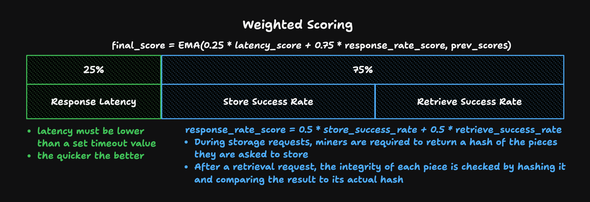

# Storb - An Overview

## TLDR

The subnet can be used as shown below:


Uploading files

- Client hits a validator endpoint to upload a file. This can be done by sending a file to its http endpoint:

    ```bash
    curl -X POST http://{ip}:{port}/file -F "file=@{path/to/file}"
    ```

- The validator splits up the file into erasure-coded pieces that are then distributed to miners.
- The validator distributes the file metadata to other neurons through a DHT.
- Returns an infohash which can be used by user to download the file from the network:

    ```json
    {"infohash":"4e44d931392d68ec0318f09d48267d05c4a8d9fe852832adeeaefc47a892d23c"}
    ```

Retrieving files

- Client requests for a file through a validator. Also done through its http endpoint:

    ```bash
    curl -X GET http://{ip}:{port}/file?infohash={infohash}
    ```

- The validator uses the DHT to determine where the file pieces are stored then requests the pieces from the miners.
- The validator reconstructs the file with the pieces and sends it back to the client.

## Scoring Mechanism



Scoring is made up of multiple components:

- **Latency**: Miners are scored based on how quickly they respond to storage and retrieval requests.
- **Response Rate**: Reliable miners are the name of the game. The less a miner responds to storage and retrieval requests, the lower it is scored.
- **PDP Challenge**: The subnet uses an efficient proof of data possession (PDP) technique inspired by [Ateniese et al.](https://dl.acm.org/doi/10.1145/1315245.1315318) to ensure miners actually store the data they are asked to keep.

## Chunking and Piecing

Files are split into erasure-coded chunks, and subsequently split into pieces and stored across various miners for redundancy.


## DHT for File Metadata

File metadata — which is useful for querying miners for pieces, and, eventually, reconstructing files — is replicated and stored across neurons in the subnet in the form of a DHT.


