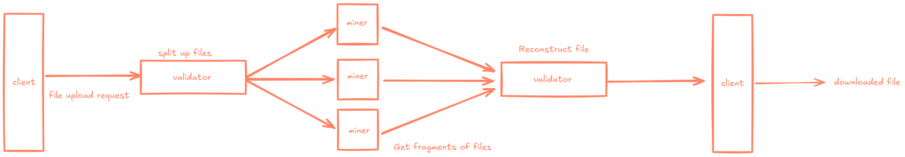
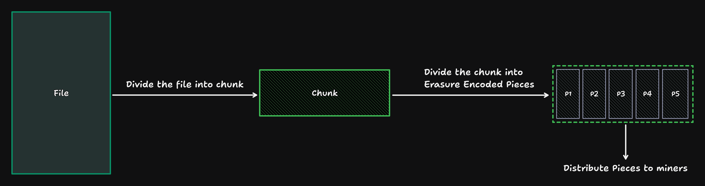
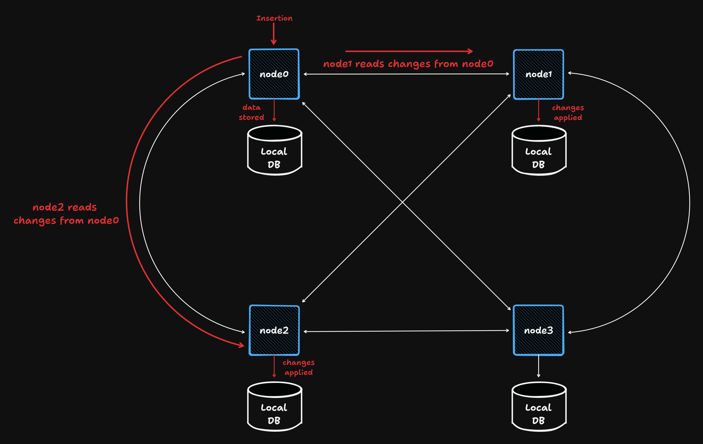

# Storb - An Overview

## TLDR

The subnet can be used as shown below:



### Uploading files

Before performing in write operations, a user must first generate and sign a nonce with a sr25519 keypair and supply it in the relevant endpoints.
In the future a client cli tool and/or SDK will be created to make this process much more seamless and automatic.

#### Generate nonce

- Generate a nonce for your account id (formatted as an ss58 address). For example:

    ```bash
    curl -X GET http://{ip}:{port}/nonce?account_id=5HeHkTeToUHmoZisZcoQDF1aJFR1Q8bZJY18FVqTV6fr8kvA" -H "X-API-Key: API_KEY"
    ```

- This will then return a nonce. For example:

```
fc52edb98e03d5e45381f7dd9e85353b84c5a4b419daf5efe0298ccbfd1d938c
```

- Using [`storb-sign`](https://github.com/Shr1ftyy/storb-sign) to sign this would output:

```
0xe23e5bc68d39a6130d1d224d08472e687d6227ce5030fc53887829f5d278e2500dc7a81ba84bad424e42648ed76c640835e614225b39a5fe6fd57f266896ac82
```

- Which without the hex prefix "0x" would be:

```
e23e5bc68d39a6130d1d224d08472e687d6227ce5030fc53887829f5d278e2500dc7a81ba84bad424e42648ed76c640835e614225b39a5fe6fd57f266896ac82
```

#### Uploading file

- Client hits a validator endpoint to upload a file. This can be done by sending a file to its http endpoint, and supplying it with the signature we previously obtained:

    ```bash
    curl -X POST http://{ip}:{port}/file?account_id=5HeHkTeToUHmoZisZcoQDF1aJFR1Q8bZJY18FVqTV6fr8kvA?signature=e23e5bc68d39a6130d1d224d08472e687d6227ce5030fc53887829f5d278e2500dc7a81ba84bad424e42648ed76c640835e614225b39a5fe6fd57f266896ac82 -F "file=@{path/to/file}" -H "X-API-Key: API_KEY"
    ```

- The validator splits up the file into erasure-coded pieces that are then distributed to miners.
- Returns an infohash which can be used by user to download the file from the network:

    ```
    4e44d931392d68ec0318f09d48267d05c4a8d9fe852832adeeaefc47a892d23c
    ```

### Retrieving files

- Client requests for a file through a validator. Also done through its http endpoint:

    ```bash
    curl -X GET http://{ip}:{port}/file?infohash={infohash} -H "X-API-Key: API_KEY"
    ```

- The validator uses its metadata db to determine where the file pieces are stored then requests the pieces from the miners.
- The validator reconstructs the file with the pieces and sends it back to the client.

### Deleting files

- Client requests to delete a file through a validator:

    ```bash
    curl -X DELETE http://{ip}:{port}/file?infohash={infohash}?account_id={account_id}?signature={signature} -H "X-API-Key: API_KEY"
    ```

- The validator deletes the file pieces from the miners and removes the metadata from its database.

## Scoring Mechanism

Our scoring mechanism uses a Bayesian approach to score the reliability of miners. For a succint overview of our scoring system please read our [litepaper](https://github.com/storb-tech/storb-research/blob/main/papers/Bayesian%20Scoring%20Litepaper.pdf)

## Chunking and Piecing

Files are split into erasure-coded chunks, and subsequently split into pieces and stored across various miners for redundancy.



## Sqlite + cr-sqlite for File Metadata and Syncing

File metadata — which is useful for querying miners for pieces, and, eventually, reconstructing files — is stored across validators in the subnet in the form of sqlite databases, all of which are synced with the help of [cr-sqlite](https://github.com/vlcn-io/cr-sqlite)


